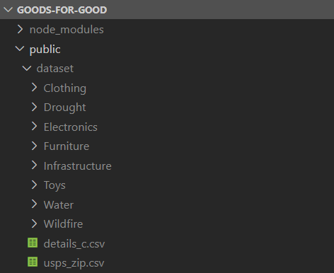
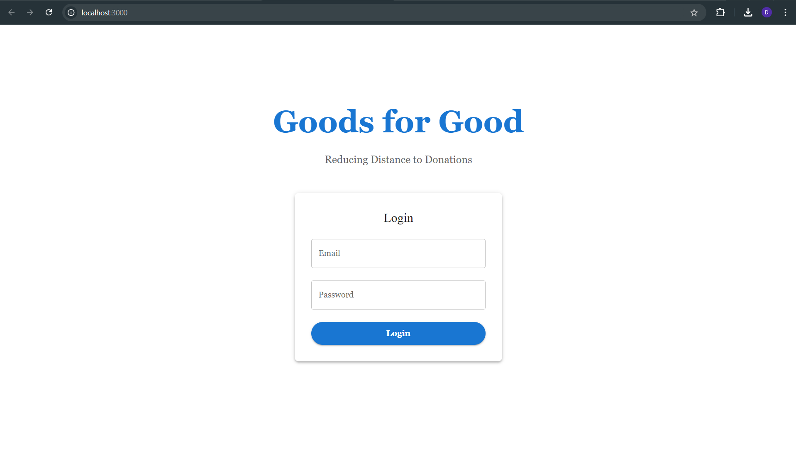

# Goods for Good
This application would allow the users to
donate goods to various campaigns posted throughout the United States. These campaigns
can target various causes like earthquakes, storms, floods, etc. Users can donate goods like
clothes, electronics, furniture and toys to campaigns of their choice by dropping it off at the
nearest USPS store. With over 7500 campaigns hosted, the application needs to be efficient
enough to help users donate to the causes of their preference. As our system does not place
any restrictions on the location, being the user needs to only drop their goods off at the
nearest USPS store, location-based filtering is not taken into consideration. A similar
application - GoFundMe does a similar task where they collect money for a specific cause.
Our solution to donate goods addresses this gap in the market to help unfortunate people by
donating items. A MongoDB distributed Architecture is setup for this to provide scalability, replication and fault-tolerance.

<b>Steps to run the project:</b>

<ol>
<li>Clone this repository</li>
<li>Download & Install Kafka</li>
<li>Download & Install React.js</li>
<li>Download & Install  Typescript</li>
<li>Download & Install  MaterialUI</li>
<li>Update AWS Keys in: <code> /scripts/backend.py line 33,34</code> </li>
<li>Update AWS Keys in: <code> /scripts/Data-Upload.ipynb Cell 12  line 6,7</code></li>
<li>Create S3 Buckets: dds-campaign-images, dds-donation-images</li>
<li>Download the Dataset - https://drive.google.com/drive/folders/1jxRhq7F2NNqh2W3sLbr22ZwpGLqBCdCD?usp=sharing </li>
<li>Move the folder to the /public</li>
<li>The folder structure should look like: </li>

<li>Create MongoDB Sharded Architecture as: </li>
<code>
docker network create mongo-shard-cluster

docker run -d --net mongo-shard-cluster --name config-svr-1 -p 27101:27017 mongo:4.4 mongod --port 27017 --configsvr --replSet config-svr-replica-set

docker run -d --net mongo-shard-cluster --name config-svr-2 -p 27102:27017 mongo:4.4 mongod --port 27017 --configsvr --replSet config-svr-replica-set

docker run -d --net mongo-shard-cluster --name config-svr-3 -p 27103:27017 mongo:4.4 mongod --port 27017 --configsvr --replSet config-svr-replica-set

docker exec -it config-svr-1 mongo

rs.initiate({
    _id: "config-svr-replica-set",
    configsvr: true,
    members: [
        { _id: 0, host: "config-svr-1:27017" },
        { _id: 1, host: "config-svr-2:27017" },
        { _id: 2, host: "config-svr-3:27017" }
    ]
})

rs.status()

###############################

docker run -d --net mongo-shard-cluster --name shard-1-node-a -p 27111:27017 mongo:4.4 mongod --port 27017 --shardsvr --replSet shard-1-replica-set
docker run -d --net mongo-shard-cluster --name shard-1-node-b -p 27121:27017 mongo:4.4 mongod --port 27017 --shardsvr --replSet shard-1-replica-set
docker run -d --net mongo-shard-cluster --name shard-1-node-c -p 27131:27017 mongo:4.4 mongod --port 27017 --shardsvr --replSet shard-1-replica-set

docker run -d --net mongo-shard-cluster --name shard-2-node-a -p 27112:27017 mongo:4.4 mongod --port 27017 --shardsvr --replSet shard-2-replica-set
docker run -d --net mongo-shard-cluster --name shard-2-node-b -p 27122:27017 mongo:4.4 mongod --port 27017 --shardsvr --replSet shard-2-replica-set
docker run -d --net mongo-shard-cluster --name shard-2-node-c -p 27132:27017 mongo:4.4 mongod --port 27017 --shardsvr --replSet shard-2-replica-set

docker run -d --net mongo-shard-cluster --name shard-3-node-a -p 27113:27017 mongo:4.4 mongod --port 27017 --shardsvr --replSet shard-3-replica-set
docker run -d --net mongo-shard-cluster --name shard-3-node-b -p 27123:27017 mongo:4.4 mongod --port 27017 --shardsvr --replSet shard-3-replica-set
docker run -d --net mongo-shard-cluster --name shard-3-node-c -p 27133:27017 mongo:4.4 mongod --port 27017 --shardsvr --replSet shard-3-replica-set

###############################
docker exec -it shard-1-node-a mongo

rs.initiate({
    _id: "shard-1-replica-set",
    members: [
        { _id: 0, host: "shard-1-node-a:27017" },
        { _id: 1, host: "shard-1-node-b:27017" },
        { _id: 2, host: "shard-1-node-c:27017" }
    ]
})
rs.status()

docker exec -it shard-2-node-a mongo

rs.initiate({
    _id: "shard-2-replica-set",
    members: [
        { _id: 0, host: "shard-2-node-a:27017" },
        { _id: 1, host: "shard-2-node-b:27017" },
        { _id: 2, host: "shard-2-node-c:27017" }
    ]
})
rs.status()

docker exec -it shard-3-node-a mongo

rs.initiate({
    _id: "shard-3-replica-set",
    members: [
        { _id: 0, host: "shard-3-node-a:27017" },
        { _id: 1, host: "shard-3-node-b:27017" },
        { _id: 2, host: "shard-3-node-c:27017" }
    ]
})
rs.status()

#############################

docker run -d --net mongo-shard-cluster --name router-1 -p 27141:27017 mongo:4.4 mongos --port 27017 --configdb config-svr-replica-set/config-svr-1:27017,config-svr-2:27017,config-svr-3:27017 --bind_ip_all

docker run -d --net mongo-shard-cluster --name router-2 -p 27142:27017 mongo:4.4 mongos --port 27017 --configdb config-svr-replica-set/config-svr-1:27017,config-svr-2:27017,config-svr-3:27017 --bind_ip_all

#############################

docker exec -it router-1 mongo

sh.addShard("shard-1-replica-set/shard-1-node-a:27017", "shard-1-replica-set/shard-1-node-b:27017", "shard-1-replica-set/shard-1-node-c:27017")

sh.addShard("shard-2-replica-set/shard-2-node-a:27017", "shard-2-replica-set/shard-2-node-b:27017", "shard-2-replica-set/shard-2-node-c:27017")

sh.addShard("shard-3-replica-set/shard-3-node-a:27017", "shard-3-replica-set/shard-3-node-b:27017", "shard-3-replica-set/shard-3-node-c:27017")

sh.status()

################

// Connect to the mongos router
db.adminCommand({ listShards: 1 });

// Shows all shards

sh.status();

sh.enableSharding("donation-system");
db.campaigns.createIndex({ cause: 1 })
db.campaigns.createIndex({ title: "text"});
sh.shardCollection("donation-system.campaigns", { cause: 1 })

sh.splitAt("donation-system.campaigns", { cause: "Flooding and Water-Related" });
sh.splitAt("donation-system.campaigns", { cause: "Heat and Drought" });
sh.splitAt("donation-system.campaigns", { cause: "Wind and Storm" });

sh.moveChunk("donation-system.campaigns", { cause: "Flooding and Water-Related" }, "shard-1-replica-set")
sh.moveChunk("donation-system.campaigns", { cause: "Heat and Drought" }, "shard-2-replica-set")
sh.moveChunk("donation-system.campaigns", { cause: "Wind and Storm" }, "shard-3-replica-set")

If facing error in secondary mongo shell: rs.secondaryOk()
</code>
<li>Start All Mongo Docker Containers</li>
<li>Pip install required packages for backend.py and Data-Upload.ipynb</li>
<li>Execute Data-Upload.ipynb to insert data and upload images in s3 
<b>WARNING: This procedure will take approximately 3-4 hours.</li></b>

<li>Navigate to the kafka folder</li>

<li>Start Zookeeper in the first terminal with the command -  
<code>.\bin\windows\zookeeper-server-start.bat .\config\zookeeper.properties</code></li>
<li>Start Broker in the second terminal using the command - 
<code>.\bin\windows\kafka-server-start.bat .\config\server.properties</code></li>

<li>Navigate to scripts folder as - <code>cd scripts</code></li>
<li><code>python backend.py</code></li>
<li>Install required packages - <code>npm install</code></li>
<li>Open a new terminal</li>
<li>Start Frontend -  <code>npm start</code></li>

<li>Use your email address to login
 You can keep the password field empty</li>
</ol>